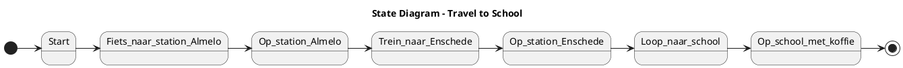
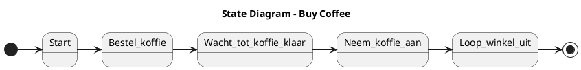
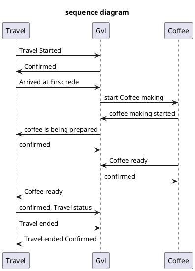

# Chapter 1
# Documentatie

```plantuml
@startuml
@startuml
title State Diagram - Travel to School

[*] -> Start
Start -> Fiets_naar_station_Almelo
Fiets_naar_station_Almelo -> Op_station_Almelo 
Op_station_Almelo -> Trein_naar_Enschede
Trein_naar_Enschede -> Op_station_Enschede
Op_station_Enschede -> Loop_naar_school 
Loop_naar_school -> Op_school_met_koffie
Op_school_met_koffie -> [*]
@enduml
```

```plantuml
@startuml
title State Diagram - Buy Coffee

[*] -> Start
Start -> Bestel_koffie
Bestel_koffie -> Wacht_tot_koffie_klaar
Wacht_tot_koffie_klaar -> Neem_koffie_aan
Neem_koffie_aan -> Loop_winkel_uit
Loop_winkel_uit -> [*]

@enduml
```

```plantuml
@startuml

title sequence diagram

Travel -> Gvl : Travel Started
Gvl -> Travel  : Confirmed

Travel -> Gvl : Arrived at Enschede
Gvl -> Coffee : start Coffee making

Coffee-> Gvl : coffee making started


Gvl -> Travel : coffee is being prepared
Travel -> Gvl : confirmed

Coffee -> Gvl : Coffee ready
Gvl -> Coffee : confirmed
Gvl -> Travel : Coffee ready
Travel -> Gvl : confirmed, Travel status

Travel -> Gvl : Travel ended
Gvl -> Travel: Travel ended Confirmed
@enduml
```